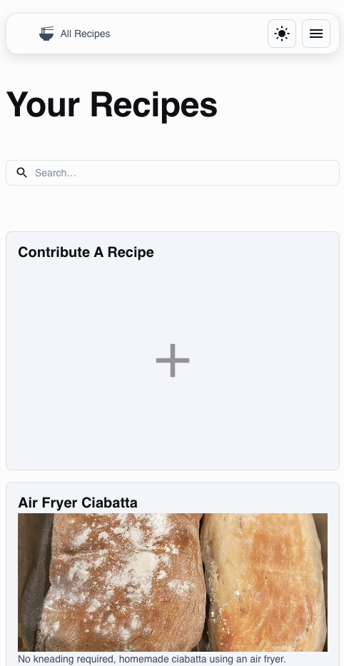

# Enjoy Your Meal - Frontend

Welcome to the **Enjoy Your Meal** frontend, a React + TypeScript application designed to interact with the backend API, allowing users to share, favorite, and manage recipes seamlessly.

## 🚀 Project Overview
**Enjoy Your Meal** is a recipe website designed to allow users to:
- Share their favorite recipes.
- Organize recipes into menus.
- Favorite recipes for quick access.
  
MUI template link: *(https://mui.com/material-ui/getting-started/templates/blog/)*

Backend repository link: *(https://github.com/KaiLi0822/enjoy-your-meal-backend)*

## 🌟 Features
- **Responsive Design:** Optimized for different screen sizes (as shown in the screenshot below).
- **User Authentication:** Secure sign-in/sign-up templates with simple validation.
- **Recipe Management:** Add, view, and manage personal recipes.
- **(Coming Soon) Search Functionality:** Search recipes easily.

### 🖼️ Screenshots


## 📦 Project Structure
```
├── public
├── src
│   ├── contexts
│   ├── recipes
│   ├── shared-theme
│   ├── sign-in
│   ├── sign-up
│   ├── types
│   └── utils
├── index.html
├── package.json
└── vite.config.ts
```

## ⚙️ Installation & Setup
1. **Clone the repository:**
   ```bash
   git clone <repository-link>
   cd enjoy-your-meal
   ```
2. **Install dependencies:**
   ```bash
   npm install
   ```
3. **Run the development server:**
   ```bash
   npm run dev
   ```
4. **Build for production:**
   ```bash
   npm run build
   ```

## 🗂️ Tech Stack
- **Frontend:** React, TypeScript
- **Styling:** Material UI (MUI)
- **Routing:** React Router
- **API Client:** Axios

## 🔗 API Integration
The app uses Axios for API calls with token management:
```typescript
apiAuthClient.interceptors.request.use((config) => {
  const token = sessionStorage.getItem("accessToken");
  if (token && config.headers) {
    config.headers.Authorization = `Bearer ${token}`;
  }
  return config;
});
```

## 🚀 Deployment
The frontend and backend are deployed on an **EC2 instance** using **Nginx** as a reverse proxy.


## 📬 Contact
For any queries, feel free to reach out at *(18840864172@163.com)*.

Enjoy sharing your favorite meals! 🍽️
